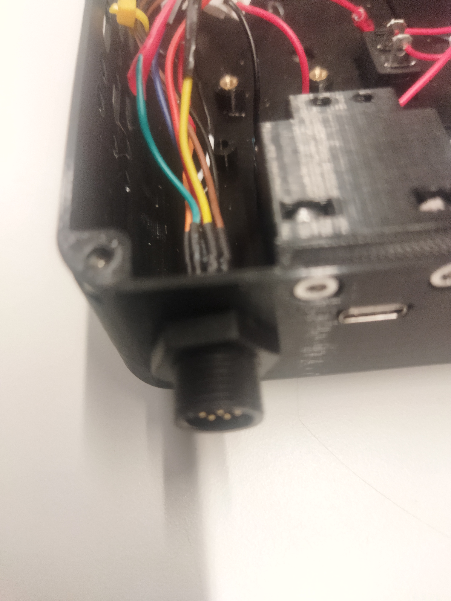
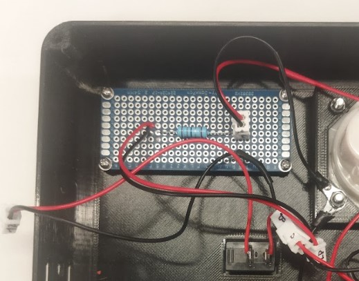
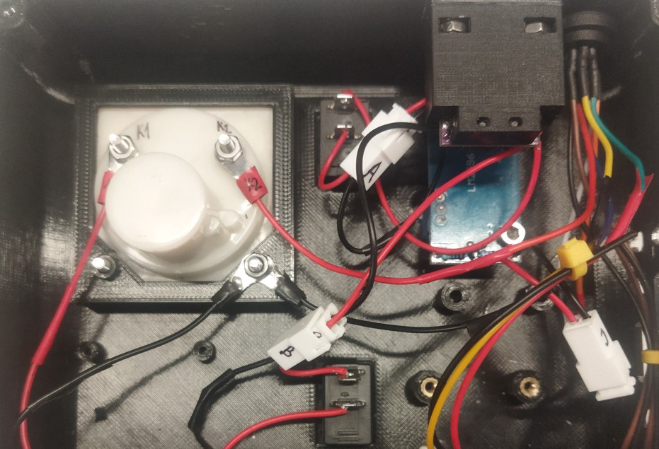
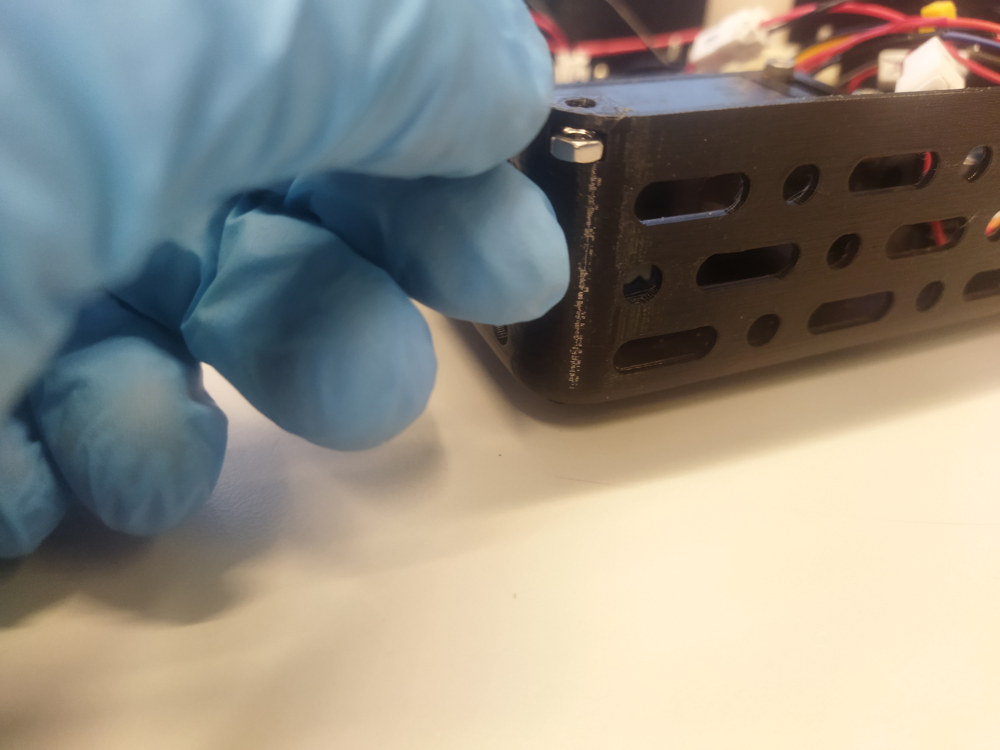

# Módulo interfaz de usuario

## LM2596 {pagestep}

Posicionar LM2596 tal que la posición del potenciómetro sea la correcta. Atornillar placa a la tapa TOP usando llave allen M3.

## Interruptores {pagestep}

Introducir señuelo de carga (tarjeta electrónica morada) a través de la perforación para el interruptor del motor. 

Introducir el segundo interruptor a través de la perforación para el láser y presionar para fijar al panel (tapa TOP).

## Señuelo de carga {pagestep}

Alinear la tarjeta electrónica morada con el adaptador como se muestra a continuación.

Atornillar pernos M2 para fijar tarjeta electrónica.

Insertar tuercas M3 y posteriormente fijar al panel (tapa TOP).

## Fijación de cable adaptador M12 {pagestep}

Introducir cable M12 desde el interior de la tapa TOP en su respectiva perforación. Posteriormente fijar la tuerca M12.

## Amperímetro {pagestep}

Introducir y presionar amperímetro en el panel (tapa TOP).  Fijar amperímetro con tuercas M3.

## Fijación de tarjeta electrónica {pagestep}

Posicionar y fijar tarjeta electrónica en panel (tapa TOP) usando 4 tornillos incluidos. Respetar orientación acorde a las siguientes imágenes.

## Conexión de cables {pagestep}

Conectar cables A, B, C y D en la misma letra según corresponda. Conectar golillas K1 y K2 en las posiciones señaladas en amperimetro. Conectar golillas color negro en el mismo perno del amperimetro según como se indica en las siguientes imágenes.

Para la conexión de las golillas utilizar tuercas M3. 

## Conexión y fijación del driver de láser {pagestep}

Conectar cables LD, 12, FAN a tarjeta Laser Driver en puertos de láser, alimentación de 12 V y ventilador respectivamente.

Voltear tarjeta de laser driver orientándola tal que el potenciómetro quede bien posicionado. Ensamblar separadores con pernos M3 para fijar tarjeta.

## Montaje de tapa acrílica {pagestep}

Posicionar 4 tuercas M3 como se muestra en la siguiente imagen.

Orientar tapa BOTTOM de acrílico como se muestra en la siguiente imagen. Apretar pernos M3 y posteriormente pegar gomas antideslizantes en cada perno.

## Ensamblaje de perillas {pagestep}

Posicionar y presionar cada perilla en cada orificio de la tapa TOP.

La interfaz de usuario ensamblada debe verse como en las siguientes imágenes.

